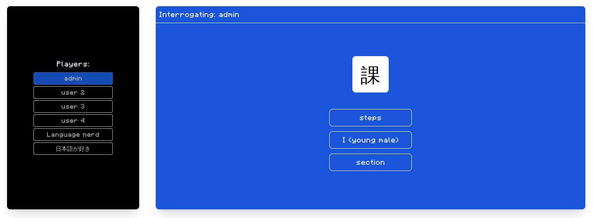

    

# Scaddr Project 

---

Scaddr is a project meant to develop mini-games for interacting with other language enthusiasts, have fun, and review your knowledge. The project fully believes in open collaboration and data privacy. 

    

## Public instances

Currently there's no public instances that we know of 

## Shared decks 

List of shared decks that one can use to review various languages or even subjects

 - [`japanese`](decks/japanese)

## Bugs

Because we want to make the act of reporting bugs easier for the users, we accept feedback both through email and the Github's Issues tracker. However, users must comply with certain formatting rules if they want the developer's attention. 

### Email 

 - Bugs are to be submitted to **jerebicak at gmail dot com**
 - **The subject must start with "SCADDR FEEDBACK:"**
 - The user must **thoroughly describe what the problem is and how to replicate it**

### Github's issues

 - The issue's title and body **MUST NOT contain emojis or CAPITALIZED WORDS**
 - The issue's body must **thoroughly describe what the problem is and how to replicate it**

## Contributions 

We highly encourage contributions and openness across the community. 

 - If you wish to code for the project, please refer to the two currently open projects ([`scaddr-frontend`](https://github.com/scaddr/scaddr-frontend) [`scaddr-backend`](https://github.com/scaddr/scaddr-backend))
 - If you wish to share your decks or instances, please do so through a pull request
 - For project ideas and questions, we have the discussions tab
 - For anything else (like spelling mistakes, additional documentation, etc.), please open a pull request

## License 

Scaddr is licensed under the MIT license. See the `LICENSE` file for more information